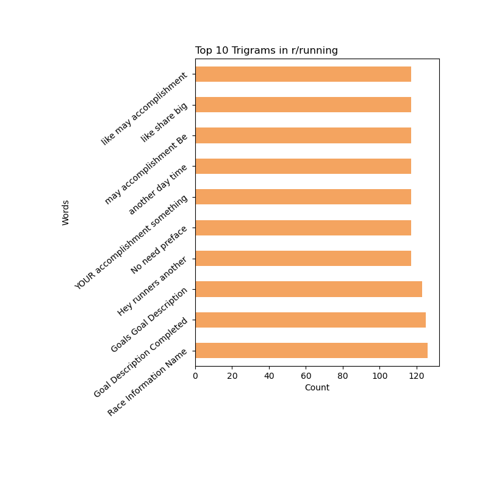

# Selling Happiness: A Sentimental Journey of Classification
***by Dillon Diatlo***

The objective of this project is to utilize Vectorization and Sentiment Analysis techniques to build a classification model that can accurately categorize which subreddit––r/running or r/Swimming––a user's post belongs to. In doing so, I will:

1) Find out which subreddit is less happy
2) Use Natural Language Processing to build classification models that can accurately categorize Reddit posts

# Data Dictionary

| Feature | Type | Dataset | Description |
| --- | --- | --- | --- |
| **datetime** | *object* | full | The date and time the reddit user posted in the format, Y-MM-DD, H:M:S |
| **all_text** | *object* | full | The combined text of every post's title and user's post description |
| **subreddit** | *int* | full | Binary categorization of subreddits r/running [0] and r/Swimming [1] |
| **sentiment** | *float* | full | A number ranked between -1 and 1 suggesting the overall sentiment of the all_text copy |
| **post_word_count** | *int* | full | The number of words in each individual all_text copy |
| **title_word_count** | *int* | full | The number of words in each individual post title |
| **upper_count** | *int* | full | The number of upper case letters found in individual all_text posts |
| **lower_count** | *int* | full | The number of lower case letters found in individual all_text posts |

# Executive Summary

## **Problem Statement:**
The objective of this project is to fit to accurately categorize Reddit posts into two separate subreddits, r/running and r/Swimming, based on word frequency and classification techniques.

## **Goals:**
The goals of this project are to analyze the subreddits r/running and r/Swimming in order to learn, based on sentiment analysis, which subreddit users are less happy, and then to build a classification model that can use post words to accurately predict which subreddit a post belongs to.

## **Project Methodology:**

*Data Collection:* 
- PRAW
- Reddit API
    - r/running
    - r/Swimming
- full.csv
    - this is an accumulation of the following csv's
        - run feb 26.csv
        - run feb 27.csv
        - swim feb 26.csv
        - swim feb 27.csv

*Data Cleaning:*
- Joined all csvs into a single csv
- Replaced NaN's with empty strings and then combined title column and selftext column into a single column: all_text
- Turned created_utc column into processable dates and times
- Dropped weekly automatic r/Swimming rows
- Dropped extra columns and created columns to count uppercase, lowercase, and post/title words
- CountVectorized the all_text column for manipulation

*Exploratory Data Analysis (EDA):* 
- Created a lemmatizer function and sentiment analysis function
- Found the top 10 and 25 most frequently used words, bigrams, and trigrams for both subreddits
- Explored the correlation between datetime and subreddit sentiment
- Explored the correlation between post/title word count and subreddit sentiment
- Explored the distribution of sentiment for posts within both subreddits
- Found the mean positivity of both subreddits

*Modeling Techniques:* 
- Found my baseline accuracy of .45
- CountVectorizer paired with a Multinomial seemed to perform poorly
- RandomForest and Logistic Regression performed the best overall
- When paired with TfidVectorizer and a GridSearchCV, I found that both Logistic Regression and RandomForest performed better and well
- After adding in a lemmatizer and only seeing a slight change, I decided to take my nearly 97%

*Key Findings:*
* Based on the analysis conducted, putting lemmatized data through a TfidVectorizer with my LogisticRegression model and fitting that to a GridSearchCV built the most accurate classification model at 96.8%. When looking at the confusion matrix, this performend just minimally better than non-lemmatized data through a TfidVectorizer and Randomforest, fit to a GridSearchCV.

* r/runner posters seem to be generally happier with a mean positve sentiment analysis of .55, compared to r/Swimming .31
    * this could mean swimmer are less happy
    * it can also mean swimmers are less concerned with accomplishmentmets like finish lines and goals
    
* There is a correlation between year and posting sentiment

* All models outperformed my baseline of 45% accuracy.

## **Plots**

## **Implications and Conclusion:**
Tfidvectorizors, paired with LogisticRegression and GridSearchCV seem to work better using anything with a CountVectorizer as Tfidvectorizers represent term frequency and rarity across corpuses, so this paired with the best hyper parameters will result in a solid prediction. Better than a CountVectorizer which is just frequency and, therefore, may include a lot of less important words.

In terms of sentiment analysis, runners have a more positive sentiment. Based on 'Top 10 r/running Trigrams', they seem to be more accomplishment focused, concentrating on wins, goals, and races. These are all emotionally driven terms. At the same time, running has a lower barrier to entry than swimming. It's something most of us can do intuitively. It's therefore easier to start, practice, get better, try races, and more. Runners may not be happier, but they are more emotionally focused.

Comparatively, posts in r/Swimming are more neutral, as can be seen in the 'Year vs Sentiment r/Swimming' and the multi spikes in 'Sentiment Distribution r/Swimming' . Additionally, r/Swimming users seem to be less accomplishment focused and more imporovement focused. This can be seen in 'Top 10 r/Swimming Bigrams' with words like "any advice", "first time", "tech suit", and "started swimming".

## **Next Steps**
Next steps are to begin narrowing down our variables to create a regression model that has a lower RMSE and can fit even better. 

1. <ins>DATETIME</ins> - Models were based on post word frequency, though I wonder if we can get a better model if we also base it on datetime.

2. <ins>STEMMING</ins> - Data was run through a lemmatizer, though not a stemmer. We should go back and see if stemming effects our models at all.

3. <ins>FILTER</ins> - Swimming's trigrams include many long, uninterpretable strings. Go back and create a stop word filter to filter out words longer than a certain length

4. <ins>PINPOINT USERS</ins> - If we are advertising happiness to sad users, we'll need more than just the subreddit they look through. Let's collect their user names and pinpoint them directly. We can also scrape their data and see where else they post and begin to build classes within our swimmer target audience.